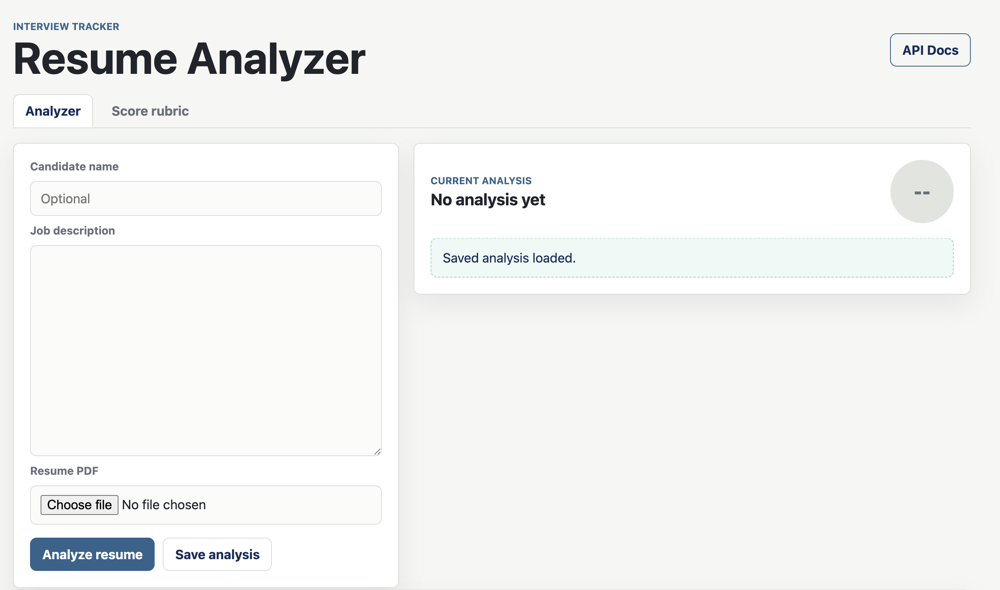
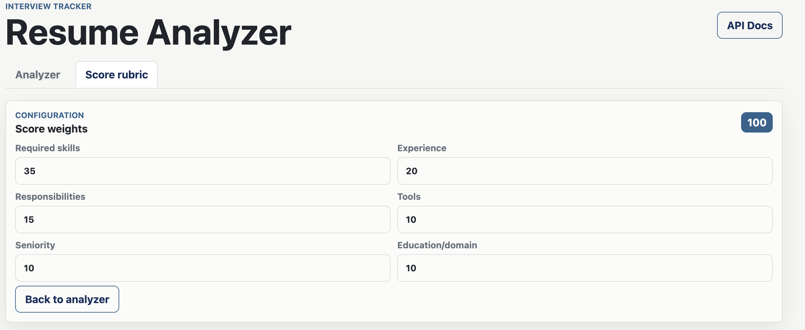
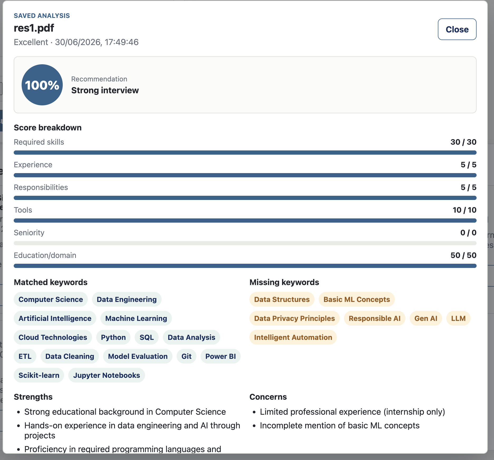

# AI Resume Analyzer

A FastAPI web app that compares a candidate resume against a job description and returns a structured fit analysis using the OpenAI API.

The app lets you paste a job description, upload a resume PDF, configure the scoring rubric, run the analysis, save the result, and view saved analyses from the database.

## Features

- Job description text input
- Resume PDF upload and text extraction
- OpenAI-powered resume analysis
- Fit score from `0-100`
- Configurable score rubric
- Score breakdown by category
- Matched and missing keywords
- Strengths, concerns, and bullet-form resume summary
- Saved analyses stored in a database
- `View` popup for full saved analysis details

## Screenshots

### Analyzer



### Score Rubric



### Saved Analysis Popup



## Tech Stack

- FastAPI
- SQLAlchemy
- SQLite by default
- OpenAI API
- pypdf
- HTML, CSS, vanilla JavaScript

## Project Structure

```text
job-app-tracker/
  backend/
    main.py
    database.py
    requirements.txt
    static/
      index.html
      app.js
      styles.css
```

## Setup

From the project root:

```bash
cd job-app-tracker/backend
python3 -m venv venv
source venv/bin/activate
pip install -r requirements.txt
```

Create a `.env` file in `job-app-tracker/backend`:

```env
OPENAI_API_KEY=your_openai_api_key_here
OPENAI_MODEL=gpt-4o-mini
```

`OPENAI_MODEL` is optional. The default is `gpt-4o-mini`.

## Run

From `job-app-tracker/backend`:

```bash
uvicorn main:app --reload
```

Open:

```text
http://127.0.0.1:8000/
```

If port `8000` is busy:

```bash
uvicorn main:app --reload --port 8010
```

## How It Works

1. Paste the job description.
2. Upload a candidate resume PDF.
3. Adjust the score rubric if needed.
4. Run the analysis.
5. Review the fit score, keywords, score breakdown, strengths, concerns, and summary.
6. Save the analysis to the database.
7. Use `View` on a saved analysis to see the full saved breakdown.

## Scoring Rubric

The score is calculated out of `100`. The rubric can be configured in the app before analysis.

Default weights:

| Category | Weight |
| --- | ---: |
| Required skills | 35 |
| Experience relevance | 20 |
| Responsibilities match | 15 |
| Tools match | 10 |
| Seniority match | 10 |
| Education/domain match | 10 |

The backend validates that the weights total `100`, caps each category score to its configured weight, and calculates the final fit score from the category totals.

## API Routes

```text
GET  /
POST /resume/analyze
POST /resume/analyze-upload
POST /resume/analyses
GET  /resume/analyses
GET  /resume/analyses/{analysis_id}
```

## Database

The app uses SQLite by default:

```text
sqlite:///./job_tracker.db
```

To use another database, set `DATABASE_URL` in `.env`.

Saved resume analyses are stored in the `resume_analyses` table.
